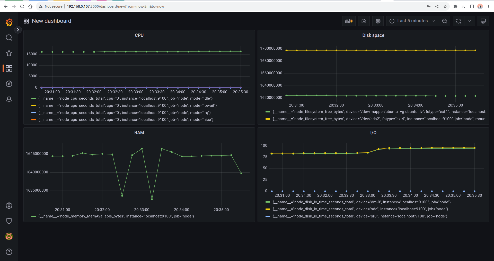

## Part 7. Prometheus и Grafana

### 1. Установить и настроить Prometheus и Grafana на виртуальную машину

``sudo apt install prometheus``
``sudo systemctl start prometheus``
``sudo systemctl status prometheus``

``wget https://dl.grafana.com/oss/release/grafana_9.2.4_amd64.deb``
``sudo apt install libfontconfig``
``sudo dpkg -i grafana_9.2.4_amd64.deb``
``sudo systemctl enable grafana-server``
``sudo systemctl start grafana-server``

## 2. Получить доступ к веб интерфейсам с локальной машины 

## 3. Добавить на дашборд Grafana отображение ЦПУ, доступной оперативной памяти, свободное место и кол-во операций ввода/вывода на жестком диске 

## 4. Запустить ваш bash-скрипт из Части 2

## 5. Посмотреть на нагрузку жесткого диска (место на диске и операции чтения/записи)

## 6. Установить утилиту stress и запустить команду ``stress -c 2 -i 1 -m 1 --vm-bytes 32M -t 10s``

## 7. Посмотреть на нагрузку жесткого диска, оперативной памяти и ЦПУ

