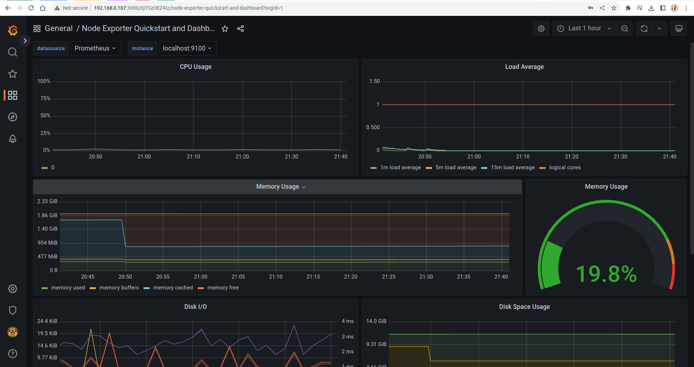
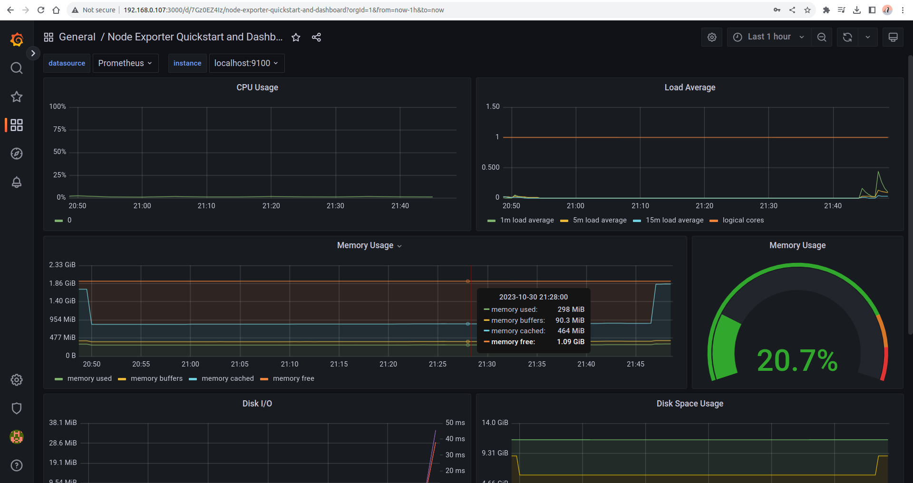
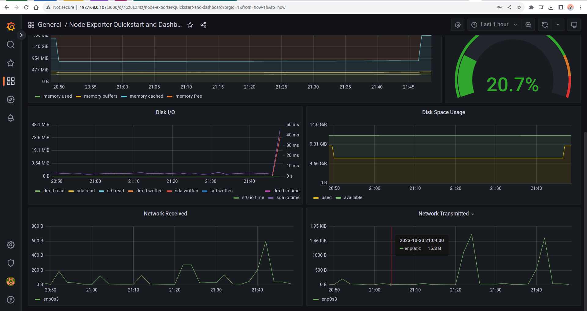
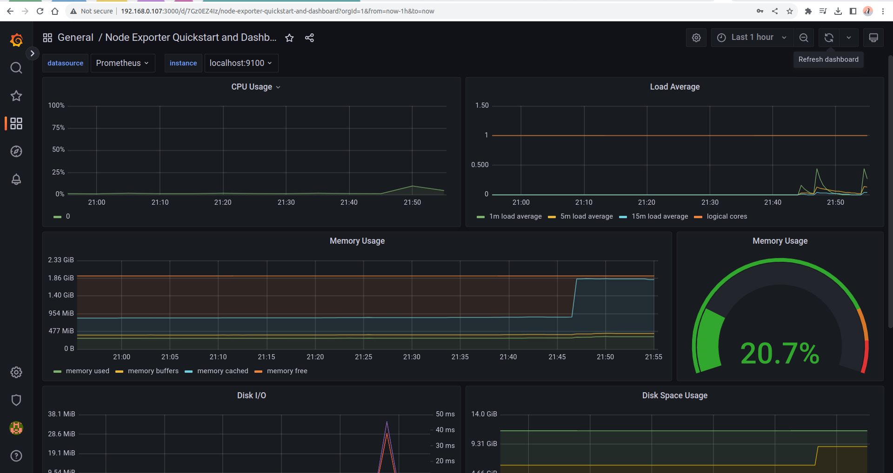
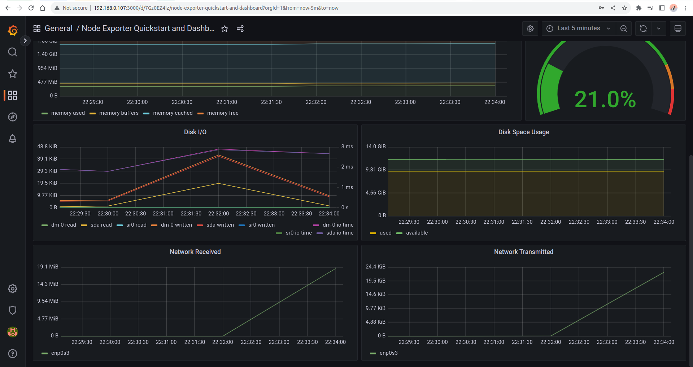

## Part 8. Готовый дашборд

### 1. Установить готовый дашборд Node Exporter Quickstart and Dashboard с официального сайта Grafana Labs

### 2. Провести те же тесты, что и в Части 7

- Запускаем bash-скрипт из Части 2

- Запускаем ``stress -c 2 -i 1 -m 1 --vm-bytes 32M -t 10s``

### 3. Запустить ещё одну виртуальную машину, находящуюся в одной сети с текущей. Запустить тест нагрузки сети с помощью утилиты iperf3

### 4. Посмотреть на нагрузку сетевого интерфейса

