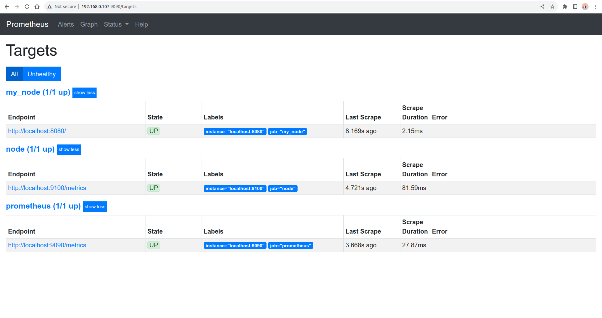
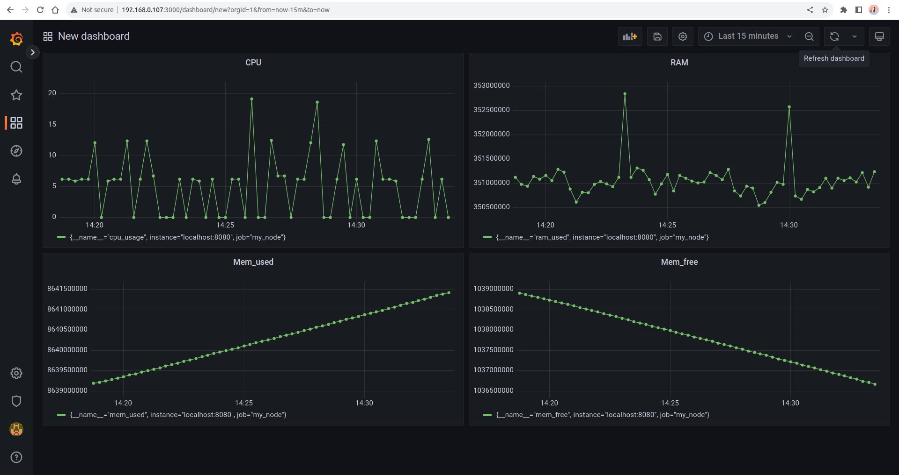
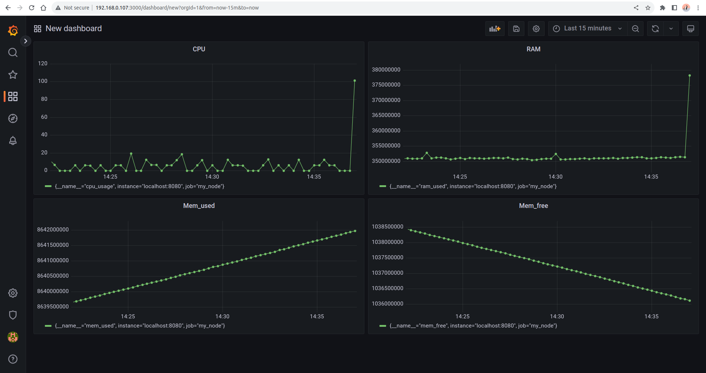

## Part 9. Дополнительно. Свой node_exporter

``sudo apt install nginx``

- Добавим в конфигурационный файл nginx.conf:
```
    server {
        listen 8080;
        location / {
            root /usr/share/nginx/html;
            index index.html;
        }
    }
```

- Добавим в файл prometheus.yml:

```
- job_name: 'my_node'
metrics_path: /
static_configs:
  - targets: ['localhost:8080']
```

- Запустим скрипт и проверим добавились ли новые метрики 



- Запускаем bash-скрипт из Части 2



- Запускаем ``stress -c 2 -i 1 -m 1 --vm-bytes 32M -t 10s``


